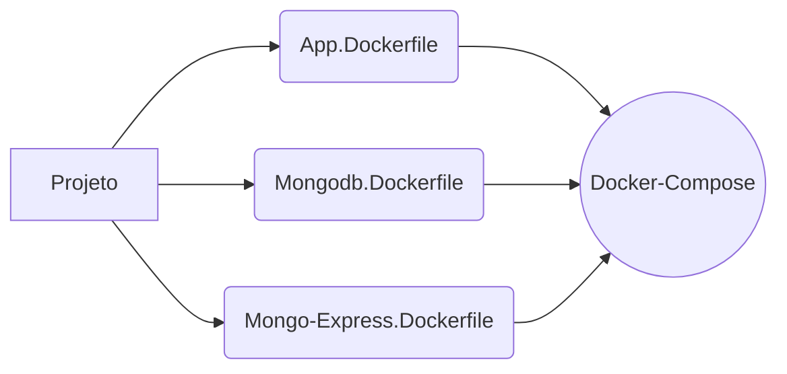

#  Docker Essencial

Este projeto faz parte do curso de introdução ao Docker oferecido por [TechEduca](https://www.youtube.com/watch?v=OERbOJZwGAU&list=PLViOsriojeLrdw5VByn96gphHFxqH3O_N).

Neste curso aprendemos alguns dos principais comandos e ferramentas como:

	- docker build
	- docker run 
	- docker container ps
	- docker container ps -a
	- docker container prune
	- docker images
	- docker rmi $(docker image -q)
	- docker volume ls
	- docker volume prune
	- docker network ls
	- docker network --driver [drive] [nome network]
	- docker compose up
	- docker compose down
		
Junto algumas flags auxiliares de acordo com o contexto.

## Projeto

Este projeto consiste um app [NodeJS](https://nodejs.org/en) no qual conecta-se ao um banco de dados [MongoDB](https://www.mongodb.com/pt-br) e utiliza o [Mongo-Express](https://github.com/mongo-express/mongo-express) para interface dos dados.
Nosso foco foi desenvolver um [Dockerfile](https://docs.docker.com/reference/dockerfile/) a cada um e depois integra-los utilizando um [Docker-Compose](https://docs.docker.com/compose/).

## Execução

Verifique se possuí o docker instalado através do cmd ou wsl (Windows):
<code>
    docker --version
</code>

Com docker instalado realize o clone deste repositório:
<code>
    git clone [repositório]
</code>

Execute o comando abaixo na raíz do projeto
<code>
    docker compose up -d
</code>

Após execução do composer, digite:
<code>
    start http://localhost:3000
</code>